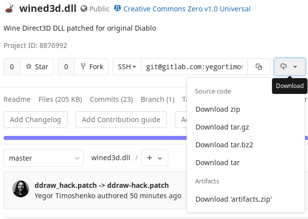

This builds patched `wined3d.dll` for the original Diablo on Wine. Linux only.

## Install

Click Download button in GitLab UI and select `artifacts.zip`:



Archive contains three folders: `stable`, `development`, and `staging`. Copy
DLL from folder matching your Wine flavor and (preferably) version to folder
with `Diablo.exe`.

Then, set `Diablo.exe` DDraw renderer to GDI:

```
wine REG ADD HKEY_CURRENT_USER\\Software\\Wine\\AppDefaults\\Diablo.exe\\Direct3D /V DirectDrawRenderer /T REG_SZ /D gdi
```

Launch Diablo. Menu should now be visible, but not without glitches: animated
images only update on mouse hover.

Mind that, as of Wine 2.11, Diablo does not run on [Wine Staging][].

[Wine Staging]: https://wiki.winehq.org/Wine-Staging

## Build from source

You will need to install [Nix](https://nixos.org/nix/).

Run `nix-build -A <target>` inside this repo's directory, where target can be
one of: `stable`, `development`, `staging`.

After the build is completed, `result` symlink will point to the patched DLL.

If you want a DLL for macOS, that's the only option at the moment.
